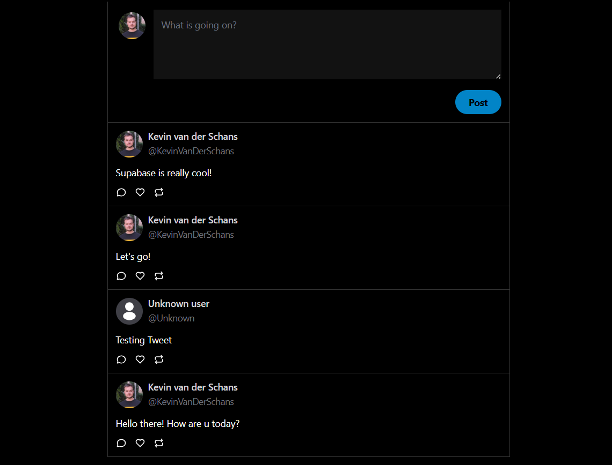

# Twitter Clone

## NextJS / ReactTS / Supabase

<br>

<div align="center">
  
</div>

<br>

<div>

    Twitter clone for creating and viewing your own Tweets.
    Supabase is used to authenticate users, enable GitHub login and manage data.

</div>

<br>

---

# Index

1. [Project Setup](#project-setup)

2. [Project Routes](#project-routes)

3. [Features](#features)

4. [Technologies and Tools Used](#technologies-and-tools-used)

5. [Contribution](#contribution)

6. [Project Status](#project-status)

7. [Project Developer](#project-developer)

<br>

## Project Setup

These are the instructions to setup and run the project in your local environment.

### Prerequisites

Before running this project locally, ensure that you have the following tools installed:

- **Node.js** <br> Version 16.x or higher (required for running Next.js). <br> You can download and install Node.js from
  [here](https://nodejs.org/). <br> Make sure you're using a version compatible with the project's dependencies
  (>=16.x).

- **npm** or **yarn** <br> Package managers to install dependencies. <br> Either **npm** (comes with Node.js) or
  **yarn**. Install **yarn** (if preferred) by running: `npm install --global yarn`

- **Git** <br> For cloning the repository. <br> Version control tool to clone the repository. Install from
  [here](https://git-scm.com/).

### Clone the repository

Clone the repository to your local machine using the following command:

```sh
  git clone https://github.com/KevinVanDerSchans/clone-twitter-nextjs-supabase.git
```

### .env.local file

Make sure to create a .env.local file in the project root for the necessary environment variables.

```sh
  NEXT_PUBLIC_SUPABASE_URL=<your-supabase-url>
```

```sh
  NEXT_PUBLIC_SUPABASE_ANON_KEY=<your-supabase-anon-key>
```

### Install dependencies

Install the project dependencies using the following command:

```sh
  npm install
```

### Generate local database

Create your own local database by collecting data from Supabase.

```sh
  npm run gen:types
```

### Run the development server

Run the development server to verify everything is working correctly:

```sh
  npm run dev
```

### Access the application

Open your browser and navigate to http://localhost:3000/ to see the application running.

<br>

### Other scripts

Compile and Minify for Production:

```sh
  npm run build
```

Lint with [ESLint](https://eslint.org/):

```sh
  npm run lint
```

### Learn More

To learn more about Next.js, take a look at the following resources:

- [Next.js Documentation](https://nextjs.org/docs) - learn about Next.js features and API.
- [Learn Next.js](https://nextjs.org/learn) - an interactive Next.js tutorial.

<br>

## Project Routes

| Route    | Description                                     |
| -------- | ----------------------------------------------- |
| `/`      | Landing page. Protected route.                  |
| `/login` | Login page to log in with GitHub.               |
| `/404 `  | Error page displayed when a route is not found. |

<br>

## Features

<div>

    ✔️ Create your own Tweets

    ✔️ Log in with GitHub

    ✔️ Manage data with Supabase

    ✔️ Fully responsive design, optimized for accessibility and SEO performance

</div>

<br>

## Technologies and Tools used

<div align="center">
  <br>
    <a href="https://nextjs.org/" target="_blank" rel="noreferrer"> </a>
    <a href="https://es.react.dev/" target="_blank" rel="noreferrer"> </a>
    <a href="https://supabase.com/" target="_blank" rel="noreferrer"> </a>
    <br>
    <br>
    <a href="https://www.typescriptlang.org/" target="_blank" rel="noreferrer"> </a>
    <a href="https://tailwindcss.com/" target="_blank" rel="noreferrer"> </a>
    <br>
    <br>
  <br>
</div>

<br>

## Contribution

If you want to contribute to this project, follow these steps:

1. Perform a fork to the repository.

2. Create a branch for your feature or bugfix: `git checkout -b feature/your-feature-name`

3. Make the necessary changes and commits: `git commit -m 'Add some feature'`

4. Push to branch: `git push origin feature/your-feature-name`

5. Send a pull request to the original repository.

<br>

## Project Status


<br>

## Project Developer

| [<br><sub>Kevin Schans</sub>](https://github.com/KevinVanDerSchans) |
| :--------------------------------------------------------------------------------------------------------------------------------------------: |
